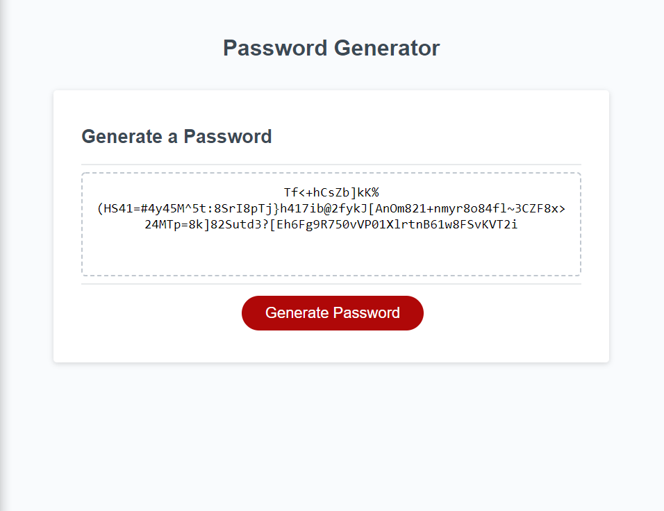

# Password Generator
```
Live Site Link: https://jasonmcd96.github.io/Password-Generator/
```
## Description
Password Generator is an app that when the generate password button is clicked, the user answers a series of prompts to genrate a unique password. The prompts include whether to use numbers, lowercase letters, capital letters, and special characters. The user is also asked to enter a length for the password. The program requires the user to select at least one of the four types of characters to generate, otherwise an error is thrown. Also, the user must enter a valid number from 8 -> 128 inclusive, otherwise an error is thrown. Once all criteria have been met, the password is then generated using a few random number generations. One to choose wich type of character to generate, and another to chose the actual character that is used. Once the password is generated it is written to the large box above the generate button.

## Demo Image

The following image shows the web application's appearance and functionality:

